# **Telcom Customer Churn Exploratory Data Analysis**
---
## **Sample Data:**
| customerID   | gender   |   SeniorCitizen | Partner   | Dependents   |   tenure | PhoneService   | MultipleLines    | InternetService   | OnlineSecurity      | OnlineBackup        | DeviceProtection    | TechSupport         | StreamingTV         | StreamingMovies     | Contract       | PaperlessBilling   | PaymentMethod             |   MonthlyCharges |   TotalCharges | Churn   |
|:-------------|:---------|----------------:|:----------|:-------------|---------:|:---------------|:-----------------|:------------------|:--------------------|:--------------------|:--------------------|:--------------------|:--------------------|:--------------------|:---------------|:-------------------|:--------------------------|-----------------:|---------------:|:--------|
| 3274-NSDWE   | Female   |               0 | No        | No           |       68 | Yes            | No               | No                | No internet service | No internet service | No internet service | No internet service | No internet service | No internet service | Two year       | No                 | Credit card (automatic)   |            19.6  |        1441.65 | No      |
| 1571-SAVHK   | Male     |               0 | No        | No           |       12 | Yes            | Yes              | Fiber optic       | No                  | No                  | No                  | Yes                 | Yes                 | Yes                 | Month-to-month | Yes                | Mailed check              |            99.95 |        1132.75 | Yes     |
| 4727-MCYZG   | Male     |               0 | No        | No           |        1 | Yes            | No               | DSL               | No                  | No                  | No                  | No                  | No                  | Yes                 | Month-to-month | No                 | Mailed check              |            55.55 |          55.55 | No      |
| 9819-FBNSV   | Male     |               1 | Yes       | No           |       37 | Yes            | No               | Fiber optic       | No                  | No                  | No                  | No                  | No                  | No                  | Month-to-month | Yes                | Bank transfer (automatic) |            72.25 |        2575.45 | No      |
| 0743-HRVFF   | Female   |               0 | Yes       | Yes          |       51 | No             | No phone service | DSL               | No                  | No                  | Yes                 | Yes                 | Yes                 | Yes                 | One year       | Yes                | Electronic check          |            56.15 |        2898.95 | No      |

---
---
## **Data Overview:**
```
Rows: 7043
Columns: 20
```

```
Duplicated Columns: 0 (0.0%)
Duplicated Rows: 22 (0.3%)
```
```
Total NaN Values: 11
Total NaN Rows: 11
Total NaN Rows Percentage: 0.16%
```
|                  |   total_nan | nan%   | dtypes   |   uniques | mean   | median   | mode             | std     | min   | 25%    | 50%     | 75%     | max    |
|:-----------------|------------:|:-------|:---------|----------:|:-------|:---------|:-----------------|:--------|:------|:-------|:--------|:--------|:-------|
| Churn            |           0 | 0.0%   | str      |         2 | -      | -        | No               | -       | -     | -      | -       | -       | -      |
| Contract         |           0 | 0.0%   | str      |         3 | -      | -        | Month-to-month   | -       | -     | -      | -       | -       | -      |
| Dependents       |           0 | 0.0%   | str      |         2 | -      | -        | No               | -       | -     | -      | -       | -       | -      |
| DeviceProtection |           0 | 0.0%   | str      |         3 | -      | -        | No               | -       | -     | -      | -       | -       | -      |
| InternetService  |           0 | 0.0%   | str      |         3 | -      | -        | Fiber optic      | -       | -     | -      | -       | -       | -      |
| MonthlyCharges   |           0 | 0.0%   | float64  |      1585 | 64.76  | 70.35    | 20.05            | 30.09   | 18.25 | 35.5   | 70.35   | 89.85   | 118.75 |
| MultipleLines    |           0 | 0.0%   | str      |         3 | -      | -        | No               | -       | -     | -      | -       | -       | -      |
| OnlineBackup     |           0 | 0.0%   | str      |         3 | -      | -        | No               | -       | -     | -      | -       | -       | -      |
| OnlineSecurity   |           0 | 0.0%   | str      |         3 | -      | -        | No               | -       | -     | -      | -       | -       | -      |
| PaperlessBilling |           0 | 0.0%   | str      |         2 | -      | -        | Yes              | -       | -     | -      | -       | -       | -      |
| Partner          |           0 | 0.0%   | str      |         2 | -      | -        | No               | -       | -     | -      | -       | -       | -      |
| PaymentMethod    |           0 | 0.0%   | str      |         4 | -      | -        | Electronic check | -       | -     | -      | -       | -       | -      |
| PhoneService     |           0 | 0.0%   | str      |         2 | -      | -        | Yes              | -       | -     | -      | -       | -       | -      |
| SeniorCitizen    |           0 | 0.0%   | int64    |         2 | 0.16   | 0.0      | 0                | 0.37    | 0.0   | 0.0    | 0.0     | 0.0     | 1.0    |
| StreamingMovies  |           0 | 0.0%   | str      |         3 | -      | -        | No               | -       | -     | -      | -       | -       | -      |
| StreamingTV      |           0 | 0.0%   | str      |         3 | -      | -        | No               | -       | -     | -      | -       | -       | -      |
| TechSupport      |           0 | 0.0%   | str      |         3 | -      | -        | No               | -       | -     | -      | -       | -       | -      |
| TotalCharges     |          11 | 0.16%  | float64  |      6530 | 2283.3 | 1397.475 | 20.2             | 2266.77 | 18.8  | 401.45 | 1397.48 | 3794.74 | 8684.8 |
| gender           |           0 | 0.0%   | str      |         2 | -      | -        | Male             | -       | -     | -      | -       | -       | -      |
| tenure           |           0 | 0.0%   | int64    |        73 | 32.37  | 29.0     | 1                | 24.56   | 0.0   | 9.0    | 29.0    | 55.0    | 72.0   |


---
---
## **Data Categories:**
| Data Category | Columns |
|---|---|
| **Numeric Data** | `tenure`, `TotalCharges`, `MonthlyCharges` |
| **Binary Numeric Data** | `SeniorCitizen` |
| **Binary Categorical Data** | `gender`, `Partner`, `Dependents`, `PhoneService`, `PaperlessBilling`, `Churn` |
| **Multiclass Ordinal Data** | `Contract` |
| **Multiclass Nominal Data** | `MultipleLines`, `InternetService`, `OnlineSecurity`, `OnlineBackup`, `DeviceProtection`, `TechSupport`, `StreamingTV`, `StreamingMovies`, `PaymentMethod` |
---
---
## **Data Distribution:**

### gender Data Distribution:

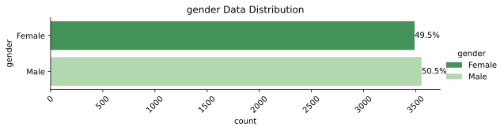

### SeniorCitizen Data Distribution:

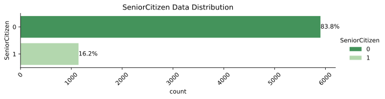

### Partner Data Distribution:


### Dependents Data Distribution:

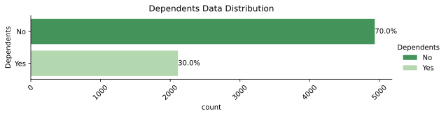

### PhoneService Data Distribution:

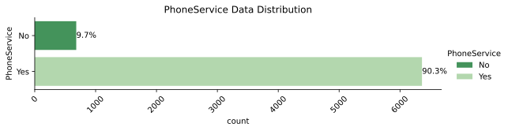

### MultipleLines Data Distribution:

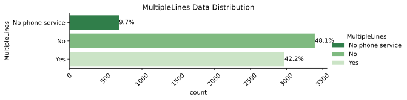

### InternetService Data Distribution:

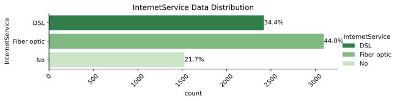

### OnlineSecurity Data Distribution:

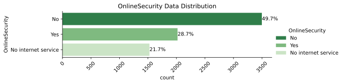

### OnlineBackup Data Distribution:

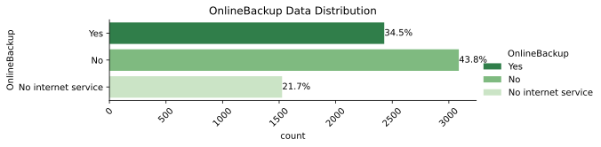

### DeviceProtection Data Distribution:

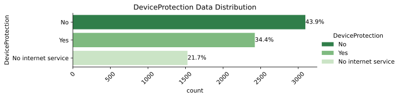

### TechSupport Data Distribution:

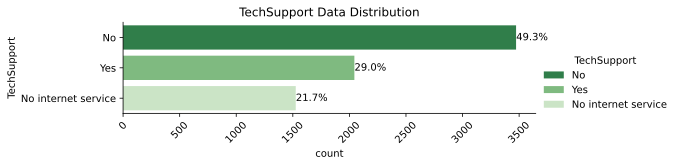

### StreamingTV Data Distribution:

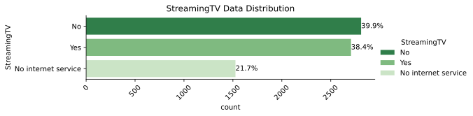

### StreamingMovies Data Distribution:

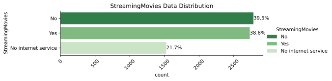

### Contract Data Distribution:

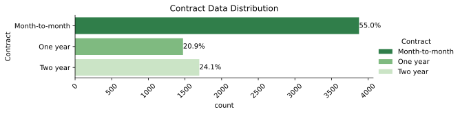

### PaperlessBilling Data Distribution:

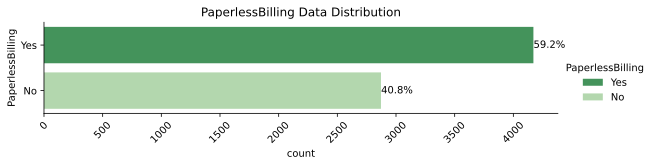

### PaymentMethod Data Distribution:

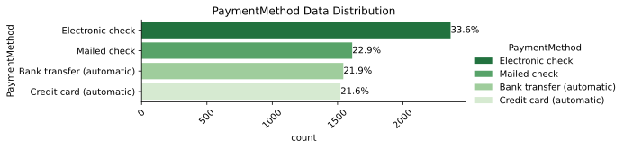

### Churn Data Distribution:

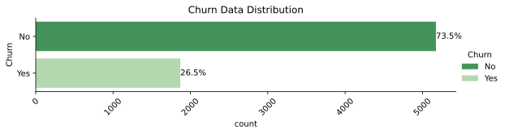

---
---
## **Churn Data Imbalance:**
- Non-churn customers: 73.5%%

- Churn customers: 26.5%%

| Churn   |   count | pct_count   |
|:--------|--------:|:------------|
| No      |    5174 | 73.5%       |
| Yes     |    1869 | 26.5%       |

---
---
## **Outlier:**
Outliers on different thresholds.

|    | column         |   t_1 |   t_1.5 |   t_2 |   t_2.5 |   t_3 |   t_4 |
|---:|:---------------|------:|--------:|------:|--------:|------:|------:|
|  0 | tenure         |     0 |       0 |     0 |       0 |     0 |     0 |
|  1 | MonthlyCharges |     0 |       0 |     0 |       0 |     0 |     0 |
|  2 | TotalCharges   |   277 |       0 |     0 |       0 |     0 |     0 |

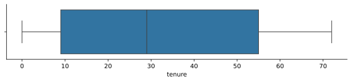

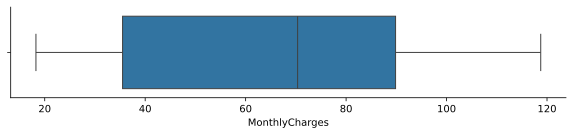

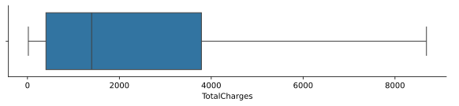

---
---
## **Bivariate Analysis:**
### 1. Contract vs Churn:
- Month-to-month, high churn
- 2-year contract, low churn

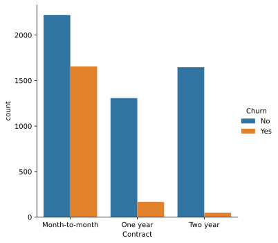

### 2. MonthlyCharges vs Churn:
- high bill, more churn
- Low charges, less churn

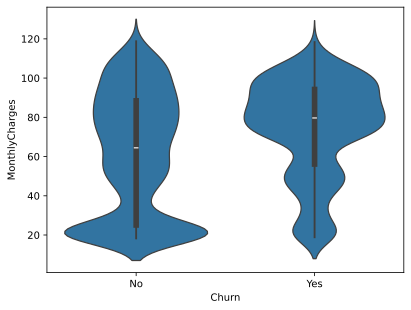

### 3. Tenure vs Churn:
- Low tenure, high churn
- High tenure, loyal customers

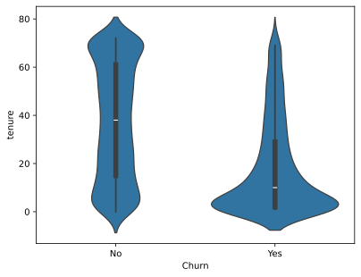

---
---
## **Multivariate Analysis:**
### Contract, MonthlyCharges, Churn:


**Month-to-month Contract**

- High MonthlyCharges, more churn

- Low MonthlyCharges, comparatively less churn


**One year Contract**

- Moderate churn


**Two year Contract**

- Almost no churn (even if charges high)

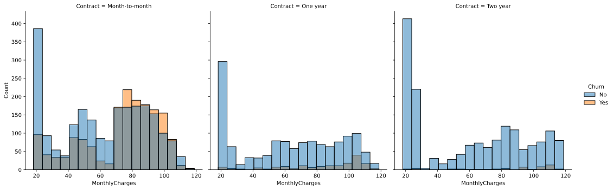

---
---
## **Correlation Analysis:**
Highly correlated features, above 0.7

|    | Feature1     | Feature2     |   Correlation |
|---:|:-------------|:-------------|--------------:|
|  0 | tenure       | TotalCharges |      0.825464 |
|  1 | TotalCharges | tenure       |      0.825464 |

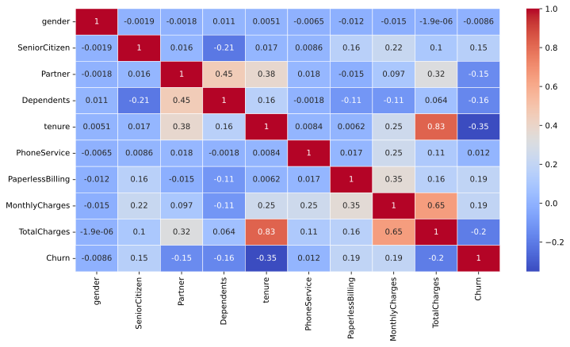


---
---
## **Key Business Insights:**

- Month-to-month contracts have highest churn

- Low tenure customers are most likely to churn

- High monthly charges increase churn risk


